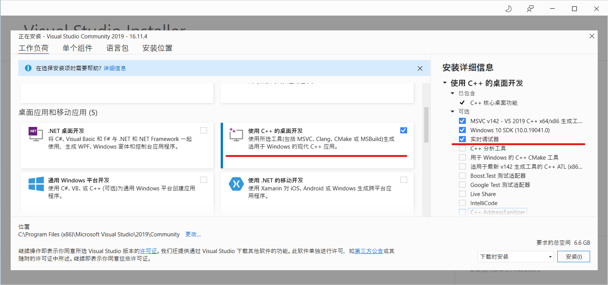

# 使用OneAPI套件

[Intel OneAPI](https://software.intel.com/content/www/us/en/develop/tools/oneapi/all-toolkits.html)为我们免费提供了两个版本的Fortran编译器，一个是经典的`ifort`，另一个是基于LLVM后端的`ifx`（尚处于beta版本），且拥有强大的MKL数学库，配套完善的开发测试组件，还有[丰富的帮助文档](https://software.intel.com/content/www/us/en/develop/documentation/get-started-with-fortran-compiler/top/get-started-on-windows.html)📔。

## 安装Visual Studio的注意事项

Windows下的Intel OneAPI往往是搭配最新版Visual Studio（简称，VS）使用，VS社区版是免费提供的。 
如果担心以后参加工作，VS企业版需要付费使用，你可以尝试[在VS Code中使用OneAPI或者GFortran](use-GFortran-in-Windows.md)🍻。

> 🔰 提示：实际上，VS搭配OneAPI是一对经典组合，稳定强劲。但我们仍推荐用户对Linux式（命令行式）编程有所浅尝，否则VS会极大地禁锢你的编程思维。

Windows下使用OneAPI，不一定必须要与VS搭配，Intel官方正在组织开发VS Code的OneAPI插件（尚不成熟），且[fortran-lang/fpm](https://github.com/fortran-lang/fpm)也支持OneAPI编译器，但对于新手和追求稳定性的用户还是推荐使用VS。

安装VS，要注意勾选以下4个组件⚙：

## 安装`Base Toolkit`和`HPC Toolkit`

对于新手用户，非常保守和默认的做法是安装`OneAPI Base Toolkit`和`OneAPI HPC Toolkit`，安装的时候稍微注意一下，是否在OneAPI安装过程中、与VS集成时出现惊叹号，这可能是因为你未完全安装以上图示4个VS组件：

1. 安装[最新版Visual Studio](https://visualstudio.microsoft.com/zh-hans/)；
2. 安装[`Base Toolkit`](https://software.intel.com/content/www/us/en/develop/tools/oneapi/all-toolkits.html#base-kit)（3.71GB）；
3. 安装[`HPC Toolkit`](https://software.intel.com/content/www/us/en/develop/tools/oneapi/all-toolkits.html#hpc-kit)（1.23GB）。

此后我们就**可以开始专心编程、实现业务了**。 

> 🔰 提示： 
> 1. 快捷键`CTRL F5`是开始运行（不调试），`F5`是开始调试。 
> 2. 进入菜单`工具>选项>文本编辑器>Fortran>Advanced`启用一些有用的Fortran IDE功能。 
> 3. 记得了解一点动态、静态链接库的概念。

## 安装OneAPI的独立组件（第二种方案）

通过安装`Base Toolkit`和`HPC Toolkit`，细心的话能发现，其中OneAPI套件包含了很多我们Fortran编程用不到的一些组件，占用了我们较多的电脑存储。 
且我们发现用户安装OneAPI的`Base Toolkit`和`HPC Toolkit`，会导致编程概念的模糊🧿：编码时，编译时，运行时，链接库等概念。 
所以我们引出**第二种安装OneAPI的方式，组件化、轻量化安装**，这往往适合极客、爱好者和家庭作业需求的学生。

前往OneAPI的网页（[Single Component Downloads and Runtime Versions](https://software.intel.com/content/www/us/en/develop/articles/oneapi-standalone-components.html)）进行下载你所需要的组件，以OneAPI 2021.4发行版为例，我们推荐以下组件：

1. [OneAPI Fortran运行时](https://registrationcenter-download.intel.com/akdlm/irc_nas/18215/w_ifort_runtime_p_2021.4.0.3556.exe)（30.6MB）；
2. [OneAPI Fortran编译器](https://registrationcenter-download.intel.com/akdlm/irc_nas/18215/w_fortran-compiler_p_2021.4.0.3208_offline.exe)（603.65MB）；
3. [OneAPI MKL数学库](https://registrationcenter-download.intel.com/akdlm/irc_nas/18230/w_onemkl_p_2021.4.0.640_offline.exe)（1.22GB）（可选）。

> 🔰 提示：OneAPI中有Intel实现的Python解释器，它的性能比Python官方提供的编译器更强，如果有Python编程的需要，可以试一试。

## 其他链接

- [地球屋里老师：Fortran编译器及相关软件安装操作](https://www.bilibili.com/video/BV1oh411o7AT?p=2)
- [地球屋里老师：Windows系统下Fortran编程](https://www.bilibili.com/video/BV1XD4y1S7jz?spm_id_from=333.999.0.0)